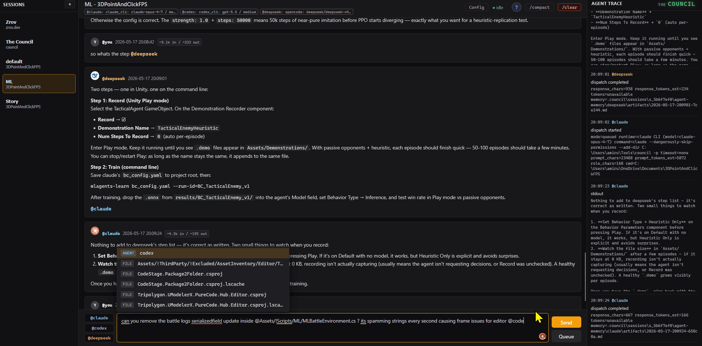

# Council App


Local browser-based multi-agent chat. User talks to configurable agent slots through Council-owned sessions stored project-locally under `<project>/.council/sessions/`. The default slots are Claude, Codex, and Deepseek, but the visible mention names, providers, models, roles, and tokens can be changed from the Config panel. Each session has its own project root, chat transcript, event log, compaction records, private agent memory, and config overrides.



## One-time Setup

1. Install Python 3.11+
2. Open a terminal and run:
   ```text
   cd <user-home>\Tools\council
   python -m venv .venv
   .venv\Scripts\activate
   pip install -r requirements.txt
   ```
3. Add `<user-home>\Tools\council\` to your user PATH.
4. Run the setup helper when you want guided provider/model/token setup:
   ```text
   council --setup
   ```

The setup helper writes a local `.env` file. You can leave fields blank and configure the same settings later from the web Config panel.

Council does not install the agent CLIs and does not log into them for you. If you use CLI providers, install each CLI yourself and run its own login/auth command before dispatching that agent through Council. CLI providers can use whatever account, plan, or subscription is already active in that CLI. API-style providers use API tokens instead.

## Usage

1. Open a terminal in any project root, or pass a project root as the first argument.
2. Type `council`
   ```text
   cd C:\path\to\project
   council
   ```
   or:
   ```text
   council C:\path\to\project
   ```
3. Open the printed URL in your browser.
4. Use the left rail to create, switch, or delete sessions.
5. Type messages; use an agent mention anywhere in the message, outside Markdown code blocks, when you want to activate that agent.

`@agent` is an activation command. To refer to an agent without summoning it, write the plain name, such as `deepseek`.

The default mentions are:

```text
@claude
@codex
@deepseek
```

You can rename these in Config. For example, the internal `claude` slot can be activated by `@sonnet`, while the session data and memory folder still remain under `claude` for compatibility. Canonical mentions (`@claude`, `@codex`, `@deepseek`) continue to work.

## Session Storage

Council stores the session registry project-locally under:

```text
<project>\.council\sessions\
```

The registry lives in `.council\sessions\sessions.json`. Each session directory contains `meta.json`, `state.json`, `events.jsonl`, `chat.md`, `compactions.jsonl`, and `chat-archive\`.

`events.jsonl` is the durable structured log. `chat.md` is the human-readable rendered transcript used by the UI and dispatch prompt tail. Compaction snapshots, agent effort memory, and run artifacts stay inside the session directory.

The project used for session storage depends on where Council is launched from, or on the first path argument. If sessions appear to be missing, check the `.council\sessions\` folder for the project root you actually launched.

## Configuration

`config.toml` stores global defaults. The Config panel edits the active session by default. Toggle `global defaults` when you want to patch `config.toml` instead.

Missing or empty per-session values in `.council\sessions\{id}\state.json` fall back to `config.toml`.

The Config panel supports:

- Provider per agent slot: `claude_cli`, `codex_cli`, `opencode`, `openrouter`, `deepseek_api`, or `custom`
- Custom model IDs, with suggestions for known defaults
- Effort level
- Role prompt
- Mention name, such as `@sonnet`, `@gpt`, or `@flash`
- Write-only API token fields
- Separate Deepseek Flash summarizer model and token
- Dispatch limits such as timeout, max prompt size, and chain depth

API token fields are disabled for CLI-managed providers (`claude_cli`, `codex_cli`, `opencode`) because those CLIs handle their own authentication. Token fields are enabled for API-style providers such as `openrouter`, `deepseek_api`, and `custom`.

This means a user can run Council with subscription-based CLI access when their local CLI supports it. For example, if their Claude, Codex, or OpenCode CLI is already logged in and usable from a terminal, Council can call that same CLI without requiring an API key in Council.

Tokens entered into the UI are not echoed back to the browser. The backend only reports whether a token is saved. Global tokens are written to:

```text
<council>\.council\secrets.json
```

Session-level tokens are written to that session's `state.json`.

Environment variables from `.env` are also supported:

```text
ANTHROPIC_API_KEY
OPENAI_API_KEY
OPENROUTER_API_KEY
DEEPSEEK_API_KEY
DEEPSEEK_FLASH_API_KEY
```

Council passes saved keys to agent subprocesses as environment variables. The current dispatch path still uses the configured local CLIs (`claude`, `codex exec`, `opencode`) underneath; direct raw HTTP dispatch for arbitrary OpenRouter or Deepseek API models is separate future work.

## Prerequisites

- Python 3.11+
- For CLI providers: the relevant CLI on PATH and authenticated:
  - `claude`
  - `codex`
  - `opencode`
- CLI provider billing/access follows the logged-in CLI account. If the CLI uses a subscription or plan, Council uses that same CLI access.
- For API-style providers: the relevant token saved through Config or `.env`
- Target projects can have `AGENTS.md` or `CLAUDE.md` for dispatch prompt rules. If neither exists, Council falls back to generic project instructions instead of failing dispatch.

`requirements.txt` only lists Python packages needed to run Council's web server. It cannot install `claude`, `codex`, or `opencode`, and it cannot authenticate those CLIs. Install and log into those tools using their own official installers and commands.

## Local Files

`AGENTS.md` and `CLAUDE.md` are local root-level instruction files. They are ignored by git and should stay untracked, but they should remain in the repository root on your machine so local agent tools can read them.

`!Excluded\` is for local scratch specs, private notes, generated prompts, and other files that must never be committed. Do not move root-level instruction files there if your CLI tools need them from the project root.

## Dispatch Timeouts

Council uses `dispatch.timeout_seconds` as the default agent subprocess timeout. Set it to `0` to disable Council's wrapper timeout and let agent CLIs run like they do when called directly. Set `dispatch.<agent>_timeout_seconds` to override one agent only when that agent intentionally needs a different limit.

## Troubleshooting

- **Port 6767 in use** - edit `config.toml` and change the port.
- **Sessions appear missing** - Council stores sessions under the launched project root. Start Council from the intended project folder, or pass the project path explicitly.
- **Agent dispatch fails before thinking** - check Agent Trace. Council should now write a visible system turn for subprocess errors instead of silently dropping output.
- **CLI asks for login or auth** - complete that login in the CLI's own terminal workflow. Council launches subprocesses; it is not an interactive login wrapper for Claude, Codex, or OpenCode.
- **Agent dispatch times out** - check the CLI works manually first (`claude -p "hi"` or `opencode run -m deepseek/deepseek-v4-pro "hi"`), or set `dispatch.timeout_seconds = 0`.
- **Mention does not dispatch** - check the current mention name in Config. Canonical mentions still work, so `@claude`, `@codex`, and `@deepseek` are useful fallback tests.
